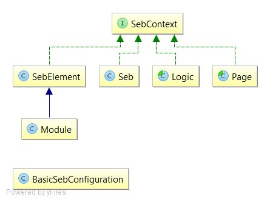

## Skeleton project

Skeleton project on [github](https://github.com/etnetera/seb-starter).

## Basic components

* `BasicSebConfiguration` - config class used to start Seb
* `SebContext` - common interface for providing Seb-related methods and stacking different components one on another
* `SebElement` - wraps traditional WebElement from Selenium
* `Module` - contains multiple SebElements
* `Seb` - wrapper for Selenium WebDriver (EventFiringWebDriver)
* `Logic` - class containing sequence of commonly used actions going through multiple pages
* `Page` - representation of PageObject

